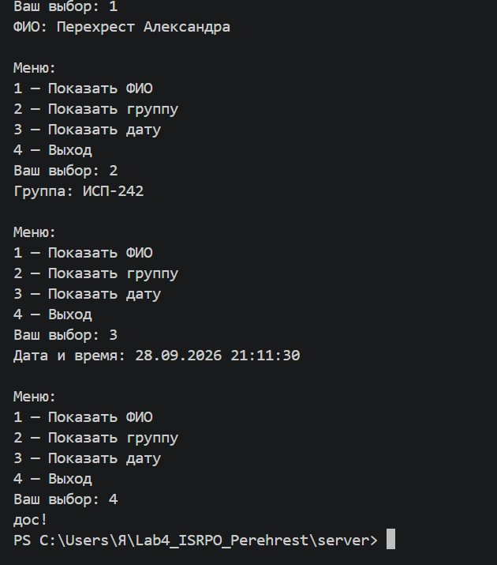
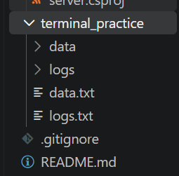
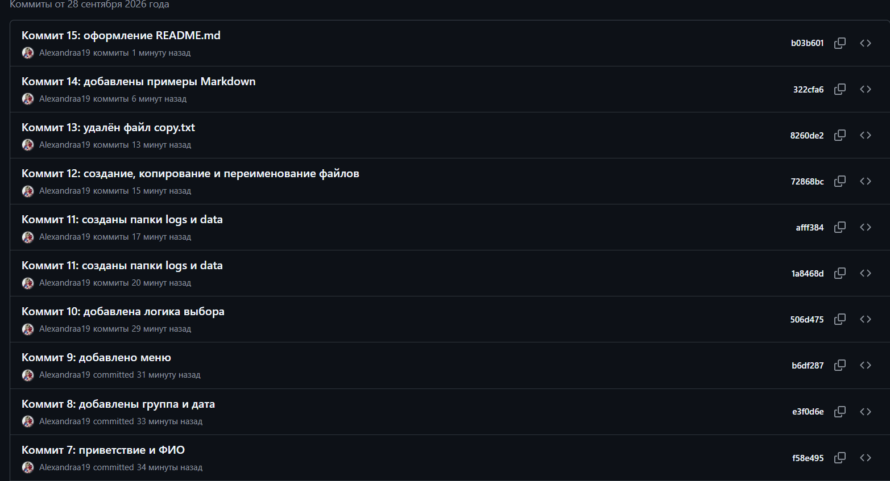

# Лабораторная работа №4

**ФИО:** Перехрест Александра  
**Группа:** ИСП-242 
**Дата:** 26.09.26

---

## Описание проекта
Проект демонстрирует навыки работы с Git, Markdown, терминалом и проектной структурой.


---

## Содержание

- [Структура проекта](#структура-проекта)
- [Примеры Markdown](#примеры-markdown)
- [LaTeX](#latex)
- [Ссылка на репозиторий](#ссылка-на-репозиторий)
- [Скриншоты](#скриншоты)
- [Заключение](#заключение)

---

## Структура проекта

```
Lab4_ISRPO_Perehrest/
├── client/
│   ├── index.html
│   └── about.html
├── docs/
│   ├── markdown_examples.md
│   └── latex_examples.md
├── repo/
│   ├── browser_Perehrest.png
│   ├── backend_Perehrest.png
│   ├── terminal_Perehrest.png
│   └── git_Perehrest.png
├── server/
│   ├── program.cs
│   └── server.csproj
├── terminal_practice/
│   ├── data/
│   ├── logs/
│   ├── data.txt
│   └── logs.txt
├── .gitignore
└── README.md
```

---

## Примеры Markdown

### Заголовок

Это пример заголовка третьего уровня.

### Список

- Git и GitHub
- C# и .NET
- HTML и CSS
- Markdown
- LaTeX

### Картинка


### Код

```bash
git status
git add .
git commit -m "Коммит"
git push origin main
```

---

## LaTeX

Inline-формула: $E = mc^2$

Block-формула:

$$
\int_0^1 x^2 \, dx = \frac{1}{3}
$$

---

## Ссылка на репозиторий

[GitHub — Lab4_ISRPO_Perehrest](https://github.com/Alexandraa19/Lab4_ISRPO_Perehrest)

---

## Скриншоты








---

## Заключение
В ходе лабораторной работы были закреплены навыки работы с системой контроля версий Git,
разметкой Markdown, командами терминала и правильной проектной структурой.
Проект содержит frontend, backend, документацию и практические примеры.
